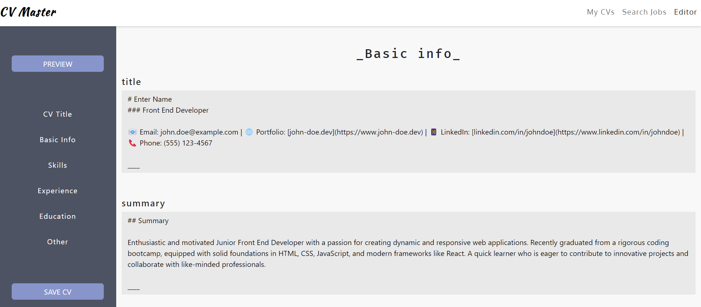
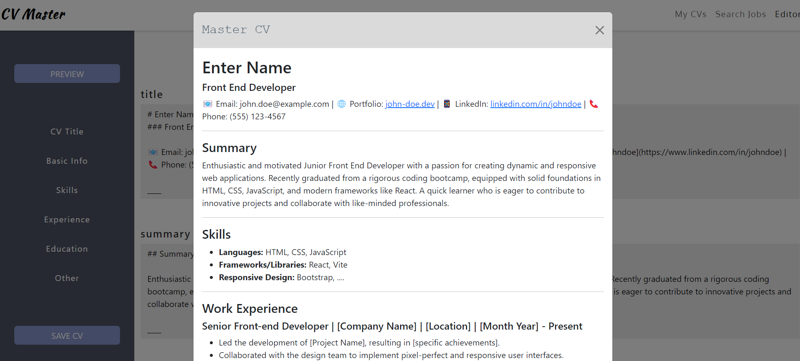

# CV Master

Welcome to CV Master, an all-in-one web application that allows users to log in to their own personalised account, create and modify CV templates, and search for new tech roles, all in one place.  The project incorporates APIs, React, npm packages, algorithms for modifying data, an object to store user data, localStorage, and more.

CV Master is a collaborative project developed by a team of Front End development course attendees. It serves as a useful tool for tech job seekers to manage their applications effectively and efficiently.

## Table of Contents

- [CV Master](#cv-master)
  - [Table of Contents](#table-of-contents)
  - [Getting Started](#getting-started)
  - [Features](#features)
    - [Onboarding](#onboarding)
    - [Dashboard](#dashboard)
  - [Motivations](#motivations)
  - [Credits](#credits)
  - [License](#license)
  - [Links](#links)
  - [License](#license-1)
  - [Resources](#resources)

## Getting Started

1. Visit the [CV Master](https://cv-master.netlify.app/) webpage.
2. Create a new user by entering a username you wish to use.
3. Use the navigation bar at the top of the page to navigate between the CV Editor, 'My CVs' Library and 'Search Jobs' pages.

_Note: This is a portfolio project and it does not follow security protocols for Registration and onboarding. Please make sure you remove such information from localStorage after use._

## Features

### Onboarding
- Users are prompted to fill in their username and then are being redirected to their Dashboard.
- New users will be taken to a brand new dashboard and will be able to create and manage CV templates.
- Existing users will be guided to their dashboard with any pre-existing CV templates. 

### Dashboard
- Users will be able to navigate through the web application using the tabs in the navigation bar.
- Users can go to the Editor to create a brand new CV template which they edit and personalise, including dragging sections in their preferred order.
- Created CVs can also be previewed within the Editor.
- Users can go to the 'My CVs' library to modify, duplicate or remove versions of their CV.
- The 'Search Jobs' tab will allow users to find most recently posted software engineering jobs, apply directly and create a personalised CV.

## Motivations

1. **API Integration:** CV Master integrates APIs to provide users with most recently posted jobs in software engineering.

2. **User Interface Design:** The project focuses on creating an intuitive and visually appealing user interface. Bootstrap is used for styling, ensuring responsiveness and a clean design.

3. **Data Management:** CV Master employs algorithms for modifying and updating user data dynamically. This includes adding, removing and altering the order of sections of data.
   
4. **Previewing Data** CV Master uses a React Markdown package to allow users' draft CVs to be previewed in a pop-up window.

5.**Interpretting data** CV Master also uses a Day.js npm package to track today's date and display the most recent jobs within the last 30 days. Day.js is also used to format and clearly display the date the jobs are posted, so that users know how recently jobs are posted.

## Credits

This project was developed by Ahmed Abshir (@syntaxError-23), Dimitris Giannoulis (@jimmygian), and Eleni Giannopoulos (@EleniMG). The GitHub repository is available at [CV Master Repository](https://github.com/wallet-wizard/cv-master).

## License

This project is licensed under the MIT License, providing flexibility for use, modification, and contributions.

## Links

- GitHub Repository: [CV Master Repository](https://github.com/wallet-wizard/cv-master)
- Live App: [CV Master](https://cv-master.netlify.app/)

## License
This project is licensed under the MIT License.

## Resources

[React Router - 'relative'](https://reactrouter.com/en/main/components/link#relative)

[How to Create and Style Borders in CSS - Anna Fitzgerald](https://blog.hubspot.com/website/css-border)

[Format - Day.js](https://day.js.org/docs/en/display/format)